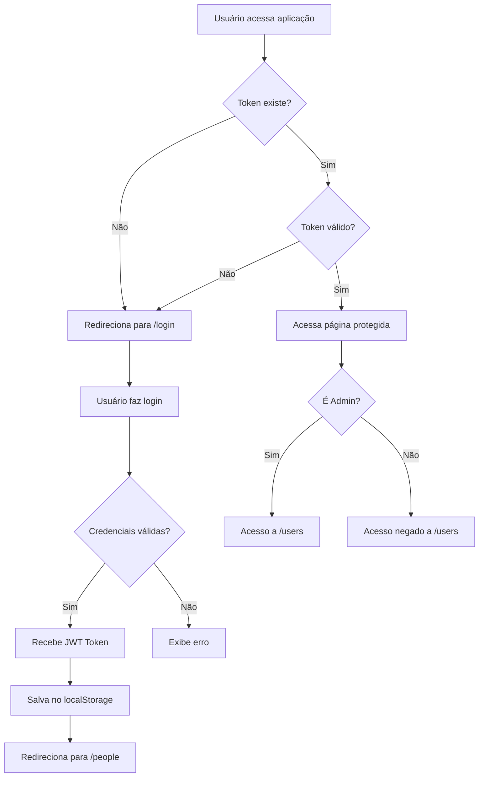

<div align="center">

# 🚀 AXION

### Plataforma Full-Stack de Gerenciamento

[](https://reactjs.org/)
[](https://www.typescriptlang.org/)
[](https://vitejs.dev/)
[](https://strapi.io/)
[](https://nodejs.org/)

**Aplicação moderna para gerenciamento de Foods, People e Places com autenticação completa e interface responsiva.**

[Sobre](#-sobre) • [Tecnologias](#-tecnologias) • [Instalação](#-instalação) • [Estrutura](#-estrutura-do-projeto) • [Features](#-funcionalidades)

</div>

---

## 📋 Sobre

AXION é uma aplicação full-stack desenvolvida com foco em demonstrar habilidades modernas de desenvolvimento web, integrando:

- **Backend robusto** com Strapi CMS headless
- **Frontend responsivo** com React + TypeScript + Vite
- **Sistema de autenticação** completo com roles de usuário
- **CRUD completo** para múltiplas entidades
- **Design moderno** com mobile-first approach

Este projeto foi desenvolvido como desafio técnico, priorizando clean code, componentização, gerenciamento de estado e boas práticas de UX/UI.

---

## 🛠 Tecnologias

## 📁 Estrutura do Projeto

```
Projeto-Oxian/
│
├── axion-test/                 # Backend (Strapi)
│   ├── api/
│   │   ├── change-password/   # API de alteração de senha
│   │   ├── foods/             # CRUD de alimentos
│   │   ├── people/            # CRUD de pessoas
│   │   └── places/            # CRUD de lugares
│   ├── config/
│   │   ├── database.js        # Configuração do DB
│   │   └── server.js          # Configuração do servidor
│   ├── extensions/
│   │   └── users-permissions/ # Extensões de autenticação
│   ├── public/uploads/        # Imagens enviadas
│   └── scripts/seed.js        # Dados iniciais
│
└── axion-web/                  # Frontend (React + Vite)
    ├── src/
    │   ├── api/
    │   │   └── client.ts      # Cliente Axios configurado
    │   ├── auth/
    │   │   ├── authService.ts # Serviços de autenticação
    │   │   ├── authStore.ts   # Store de autenticação
    │   │   └── ProtectedRoute.tsx # HOC para rotas protegidas
    │   ├── components/
    │   │   ├── Header.tsx     # Navegação principal
    │   │   ├── Layout.tsx     # Wrapper de páginas
    │   │   ├── ItemCard.tsx   # Card reutilizável
    │   │   ├── Modal.tsx      # Modal genérico
    │   │   ├── Lightbox.tsx   # Visualizador de imagens
    │   │   └── PasswordInput.tsx # Input de senha
    │   ├── hooks/
    │   │   ├── useAdminCheck.ts # Hook de verificação admin
    │   │   ├── useCRUD.ts     # Hook de CRUD genérico
    │   │   └── useSortable.ts # Hook de ordenação
    │   ├── pages/
    │   │   ├── Login.tsx      # Página de login
    │   │   ├── Foods.tsx      # Gerenciamento de Foods
    │   │   ├── People.tsx     # Gerenciamento de People
    │   │   ├── Places.tsx     # Gerenciamento de Places
    │   │   ├── Users.tsx      # Gerenciamento de Users (Admin)
    │   │   └── Profile.tsx    # Perfil do usuário
    │   ├── styles/            # Estilos globais
    │   └── App.tsx            # Rotas da aplicação
    └── vite.config.ts         # Configuração do Vite
```

---

## 🎯 Fluxo de Autenticação



---

## 🔑 Rotas da Aplicação

### Rotas Públicas
- `/` - Redireciona para login ou people (se autenticado)
- `/login` - Página de autenticação

### Rotas Protegidas (Requer Autenticação)
- `/people` - Gerenciamento de pessoas
- `/foods` - Gerenciamento de alimentos
- `/places` - Gerenciamento de lugares
- `/profile` - Perfil e alteração de senha

### Rotas Admin (Requer Role Admin)
- `/users` - Gerenciamento de usuários do sistema

---

## 🎨 Design System

### Paleta de Cores
```css
--primary: #6c63ff;        /* Roxo principal */
--primary-dark: #4f46e5;   /* Roxo escuro (hover) */
--secondary: #8b5cf6;      /* Roxo secondary (badges) */
--blue: #3b82f6;           /* Azul (botão editar) */
--blue-dark: #2563eb;      /* Azul escuro (hover) */
--red: #ef4444;            /* Vermelho (botão deletar) */
--red-dark: #dc2626;       /* Vermelho escuro (hover) */
--gray-50: #f9fafb;
--gray-100: #f3f4f6;
--gray-200: #e5e7eb;
```

### Breakpoints Responsivos
```css
@media (max-width: 1280px) { /* Desktop pequeno */ }
@media (max-width: 1024px) { /* Tablet landscape */ }
@media (max-width: 900px)  { /* Tablet portrait */ }
@media (max-width: 768px)  { /* Mobile grande */ }
@media (max-width: 480px)  { /* Mobile pequeno */ }
```

---

## 🧪 Testando a Aplicação

### Credenciais de Teste
Após executar o seed:
```
Email: admin@example.com
Senha: Admin123
```

### Fluxo de Teste Sugerido
1. ✅ Fazer login com credenciais acima
2. ✅ Navegar entre People, Foods, Places
3. ✅ Criar um novo item em cada seção
4. ✅ Editar e deletar itens
5. ✅ Acessar /users (somente admin)
6. ✅ Criar novo usuário com role User
7. ✅ Testar alteração de senha em /profile
8. ✅ Fazer logout e login com novo usuário
9. ✅ Verificar que usuário comum não acessa /users
10. ✅ Testar responsividade em mobile

---

## 📱 Compatibilidade

- ✅ Chrome 90+
- ✅ Firefox 88+
- ✅ Safari 14+
- ✅ Edge 90+
- ✅ Mobile (iOS Safari, Chrome Android)

---

## 🐛 Troubleshooting

### Backend não inicia
```bash
# Limpe node_modules e reinstale
rm -rf node_modules package-lock.json
npm install
```

### Frontend não conecta com backend
```bash
# Verifique se o backend está rodando em http://localhost:1337
# Verifique o arquivo .env no frontend
VITE_API_URL=http://localhost:1337/api
```

### Erro de CORS
```bash
# Configure o CORS no backend em config/server.js
# Já configurado para aceitar localhost:5173
```

### Imagens não aparecem
```bash
# Certifique-se de que a pasta public/uploads existe
# Verifique permissões de escrita
```

---

## 🚧 Próximos Passos

- [ ] Implementar testes unitários (Jest/Vitest)
- [ ] Adicionar testes E2E (Playwright/Cypress)
- [ ] Implementar paginação nas listagens
- [ ] Adicionar filtros e busca
- [ ] Implementar upload múltiplo de imagens
- [ ] Adicionar dark mode
- [ ] Configurar CI/CD
- [ ] Deploy em produção (Vercel + Railway)

---

## 👨‍💻 Autor

Desenvolvido como desafio técnico para demonstrar habilidades em:
- Arquitetura full-stack
- Clean code e boas práticas
- Componentização e reutilização
- TypeScript e tipagem forte
- Design responsivo e UX
- Gerenciamento de estado
- Autenticação e autorização

---

## 🛠 Tecnologias

### Frontend (`axion-web`)
| Tecnologia | Versão | Descrição |
|------------|--------|-----------|
| **React** | 18+ | Biblioteca para construção de interfaces |
| **TypeScript** | 5+ | Superset JavaScript com tipagem estática |
| **Vite** | 5+ | Build tool de alta performance |
| **React Router** | 6+ | Roteamento e navegação |
| **Axios** | - | Cliente HTTP para chamadas à API |
| **React Icons** | - | Biblioteca de ícones |
| **PostCSS Modules** | - | CSS modular e componentizado |

### Backend (`axion-test`)
| Tecnologia | Versão | Descrição |
|------------|--------|-----------|
| **Node.js** | 14 | Runtime JavaScript |
| **Strapi** | 4.0.8 | Headless CMS |
| **SQLite** | - | Banco de dados (dev) |

---

## 🚀 Instalação

### Pré-requisitos

- **Node.js**: v14 (backend) / v22 (frontend)
- **npm** ou **yarn**
- **nvm** (recomendado para gerenciar versões do Node)

### Configuração do Backend

```bash
# Navegue até o diretório do backend
cd axion-test

# Instale as dependências
npm install

# Inicie o servidor de desenvolvimento
npm run develop

# O backend estará disponível em http://localhost:1337
```

#### Popular Banco de Dados (Seed)
```bash
# Execute o script de seed para criar dados iniciais
npm run seed
```

### Configuração do Frontend

```bash
# Navegue até o diretório do frontend
cd axion-web

# Instale as dependências
npm install

# Inicie o servidor de desenvolvimento
nvm use 22 && npm run dev

# A aplicação estará disponível em http://localhost:5173
```

#### Variáveis de Ambiente
Crie um arquivo `.env` na raiz de `axion-web`:
```env
VITE_API_URL=http://localhost:1337/api
```

---

---

## ✨ Funcionalidades

### 🔐 Autenticação & Autorização
- ✅ Sistema de login completo
- ✅ Autenticação persistente (localStorage)
- ✅ Gerenciamento de roles (Admin/User)
- ✅ Rotas protegidas com ProtectedRoute
- ✅ Alteração de senha de usuário
- ✅ Logout com redirecionamento

### 📊 CRUD Completo
- ✅ **Foods**: Gerenciamento de alimentos com imagens
- ✅ **People**: Gerenciamento de pessoas com fotos
- ✅ **Places**: Gerenciamento de lugares com imagens
- ✅ **Users**: Gerenciamento de usuários (admin only)

### 🎨 Interface Moderna
- ✅ Design responsivo (mobile-first)
- ✅ Cards com overlay de títulos
- ✅ Lightbox para visualização de imagens
- ✅ Modal reutilizável para formulários
- ✅ Menu hamburger em mobile
- ✅ Feedback visual (loading, erros, sucesso)
- ✅ Tema roxo (#6c63ff) consistente

### 🧩 Componentes Reutilizáveis
- ✅ **Layout**: Wrapper com Header
- ✅ **ItemCard**: Card genérico para listagens
- ✅ **Modal**: Modal com validação de forms
- ✅ **Lightbox**: Visualizador de imagens
- ✅ **PasswordInput**: Input com toggle de visibilidade

### 🔧 Hooks Customizados
- ✅ **useAdminCheck**: Verifica permissões de admin
- ✅ **useCRUD**: Lógica reutilizável para CRUD
- ✅ **useSortable**: Ordenação de listas

---
